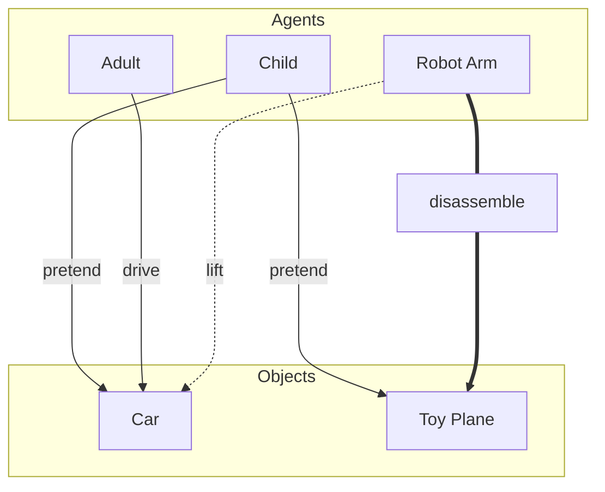

# Affordance Engine

The **Affordance Engine** is a TypeScript-based simulation framework that models interactions between agents and objects in a virtual world. It uses an Entity-Component-System (ECS) architecture to define agents, objects, and their affordances (abilities and required abilities).

## Table of Contents

- [Overview](#overview)
- [Features](#features)
- [Project Structure](#project-structure)
- [Getting Started](#getting-started)
- [Usage](#usage)
- [Key Modules](#key-modules)
  - [Entity-Component-System (ECS)](#entity-component-system-ecs)
  - [Models](#models)
  - [World Creation](#world-creation)
  - [Utilities](#utilities)
- [Demo](#demo)
- [License](#license)

---



## Overview

The Affordance Engine allows you to:

- Define agents with specific abilities.
- Define objects with required abilities for interaction.
- Evaluate affordances between agents and objects.
- Simulate and describe interactions in a virtual world.

---

## Features

- **Entity-Component-System (ECS):** A modular architecture for defining entities and their components.
- **Agent and Object Models:** Define agents with abilities and objects with required abilities.
- **Affordance Evaluation:** Determine what actions agents can perform on objects.
- **Simulation Utilities:** Tools for creating agents, objects, and describing interactions.

---

## Project Structure

The project is organized as follows:

```bash
src
├── cli
│   └── index.ts # Command-line interface for running the demo
├── ecs
│   ├── affordanceSystem.ts # Logic for evaluating affordances
│   └── entity.ts # Core ECS implementation
├── main.ts # Entry point of the application 
├── models
│   ├── abilities.ts # Defines abilities as a type
│   ├── agent.ts # Agent component model
│   └── object.ts # Object component model
├── utils
│   └── printer.ts # Utility for describing interactions
└── world
    ├── createAgents.ts # Functions for creating agents
    └── createObjects.ts # Functions for creating objects
```

---

## Getting Started

### Prerequisites

- Node.js (v16 or higher)
- npm (v7 or higher)

### Installation

1. Clone the repository:

   ```bash
   git clone <repository-url>
   cd affordance-engine
   ```

2. Initialise the project:

    ```bash
    npm init -y
    ```

3. Install dependencies:

    ```bash
    npm install typescript ts-node @types/node --save-dev && npx tsc --init
    ```
    
4. Run the development script:

    ```bash
    npx ts-node src/main.ts
    ```

5. Or compile then run: 

    ```bash
    npx tsc  # Compiles .ts to .js in `dist/` or wherever tsconfig points
    node dist/main.js
    ```

### Usage

#### Running the Demo:

The demo simulates interactions between agents and objects. To run the demo:

```bash
    node dist/main.js
```

This will execute the runDemo function in dist/, which creates a sample world and describes interactions.

---

### Key Modules

### Entity-Component-System (ECS)

The ECS architecture is implemented in `src/ecs/entity.ts:`

- Entity: Represents a unique object in the system.
- Components: Attach data to entities (e.g., AgentComponent, ObjectComponent).
- Functions:
    - `createEntity()`: Creates a new entity.
    - `addComponent(entity, key, component)`: Adds a component to an entity.
    - `getComponent(entity, key)`: Retrieves a component from an entity.

The affordance evaluation logic is in `src/ecs/affordanceSystem.ts`:

`evaluationAffordances(agent, object)`: Determines which abilities an agent can use on an object.

---

### Models
The models define the structure of agents, objects, and abilities:

- `src/models/abilities.ts`: Defines Ability as a union type (e.g., "drive", "lift", etc.).
- `src/models/agent.ts`: Defines the AgentComponent interface with name and abilities.
- `src/models/object.ts`: Defines the ObjectComponent interface with name and requiredAbilities.

---

### World Creation

Functions for creating agents and objects are in the world directory:

- `src/world/createAgents.ts`:
    - `createAgent(name, abilities)`: Creates an agent entity with the specified abilities.
- `src/world/createObjects.ts`:
    - `createObject(name, requiredAbilities)`: Creates an object entity with the specified required abilities.

---

### Utilities

The utility module src/utils/printer.ts provides functions for describing interactions:

- `describeInteraction(agent, object)`: Logs the affordances between an agent and an object.

---

### Demo

The demo in `src/cli/index.ts` creates a sample world with the following entities:

Agents:

- Child: Can `pretend`.
- Adult: Can `drive`.
- Robot Arm: Can `lift` and `disassemble`.

Objects:

- Car: Requires abilities like `drive`, `lift`, `repair`, and `pretend`.
- Toy Plane: Requires abilities like `pretend` and `disassemble`.

Sample Output:
The demo evaluates and describes interactions between agents and objects. Example output:

Child vs Car
-> Can do: pretend

Adult vs Car
-> Can do: drive

Robot Arm vs Car
-> Can do: lift

Robot Arm vs Toy Plane
-> Can do: disassemble

Child vs Robot Arm
-> Can do: Nothing

Adult vs Robot Arm
-> Can do: Nothing
